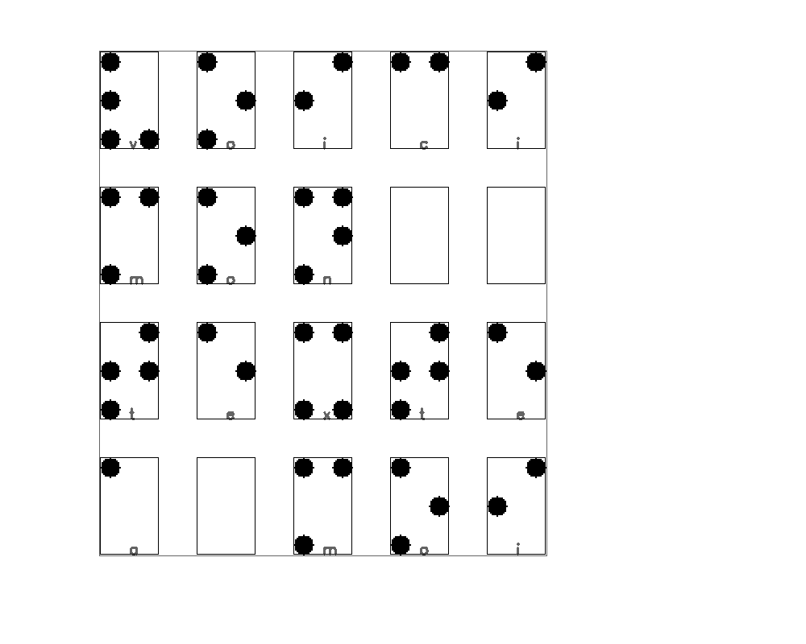

# BrailleTranslate 2022

Traducteur de braille français - Projet de la mineur ***Métiers de la création 1***

## Application

Application permettant d'avoir une première approche avec le braille

Prérequis :

Installer *tkinter*

Linux OS

```bash
python3 ./app.py
```

Windows OS

```bash
python ./app.py
```

### Aperçu


Application basée sur la table suivante :

[](https://fr.wikipedia.org/wiki/Braille)

## Traducteur de braille

Pour traduire un texte en braille, il faut déjà avoir le texte.

### 1. Ecrire du texte en braille

Prérequis :

Installer *cv2 (cv)*

Linux OS

```bash
python3 ./brailleWritter.py
```

Windows OS

```bash
python ./brailleWritter.py
```

Ce script permet de d'écrire un texte en braille sur une image blanche.

Utiliser la touche :

- "entrée" pour sauter une ligne
- "échap" pour enregistrer l'image et quiter

Une image intitulée "brailleText.png" sera ensuite enregistrée dans le dossier [`./res/`](res)


Il est possible de modifier :

- La taille des points
- La formedes points (rond ou carré)
- Les dimensions de l'image
- Le point de départ d'écriture

### 2. Lire et traduire ce texte

Prérequis :

Installer *cv2 (cv)*

#### 2.1. brailleReaderV1

Linux OS

```bash
python3 ./brailleReader.py
```

Windows OS

```bash
python ./brailleReader.py
```

Ce [`script`](./brailleReader.py)
 va ensuite récupérer l'image enregistrée précédemment pour traduire le braille qu'elle contient.

Voici le résultat :



#### 2.2. brailleReaderV2

Cette deuxième version va permettre de gérer les photos de texte braille comme celle-ci :


- 2.2.1. Conversion en noir et blanc puis seuillage de l'image

  La première étape consiste a convertir l'image en niveau de gris puis d'appliquer un **seuillage** pour n'avoir plus que des pixel noirs ou blancs.

  Il est aussi possible d'utiliser des fonctions d'**érosion** et de **dilatation** afin de supprimer d'éventuels *bruits* dans l'image.

- 2.2.2. Touver et grouper les points d'un même caractère

  Pour trouver les différents points de l'image, on utilise la fonction *findContour()* qui renvoie une liste de tous les contours présents dans l'image. On obtient ainsi une liste de tous les points avec différentes informations telles que leur taille et leurs coordonnées.

  Pour trouver les groupes de points appartenant au même caractère :

  - On parcourt la liste des points (qui ne font partie d'aucun groupe)
  - Pour chacun de ces points, on commence par le retirer de la liste et on crée un nouveau groupe de points dans lequel on le rajoute. Puis on regarde s'il y a un point qui se trouve assez proche de lui pour le rajouter dans le groupe. On recommence cette étape pour chacun des points trouvés

  Voici à quoi cela ressemble :

  

  (Les points d'un même groupe ont étés reliés par un trait)

  Problème 1 : Pour les caractères tels que celui à la deuxième ligne, première colone (la lettre x), ils sont considérés comme deux groupes de points car les points du haut sont trop distants de ceux du bas.

- 2.2.3. Déterminer la zone de chaque caractère

  Pour trouver la zone contenant le caractère entier, on commence par recupérer les coordonnées du point le plus en haut à gauche. Ce sera le coin supérieur gauche de la zone.
  
  La longueur et la largeur de la zone peuvent être calculées :
  - En fonction de la taille d'un point.
  - En fonction de la plus grande zone trouvée :

    On calcule la taille qu'occupe chaque groupe et on garde la plus grande.

    

    On applique ensuite cette taille pour tous les autres groupes :
  
    

    Problème 2 : La taille des zones ne s'adapte pas pour chaque groupe, la zone est trop grande pour les caractère de la première ligne. Cependant cela de posera pas de problème pour la suite.

Pour régler le Problème 1, il suffit de regrouper les zones qui se superposent

Voici le résultat :


## Contributeurs

- Du Thomas
- Jules Tristan
